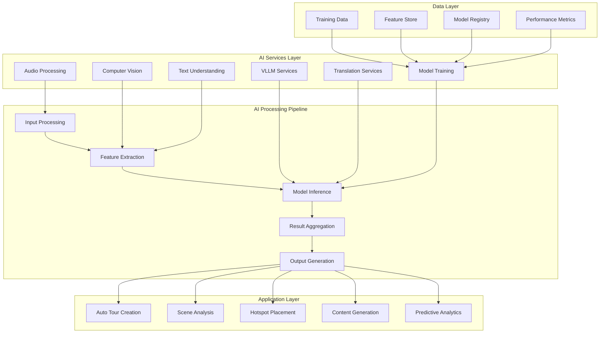

# AI Features Documentation

## Executive Summary

AI features are **Post‑MVP** capabilities that add assisted authoring and automation (scene analysis, hotspot suggestions, draft tour generation). This documentation describes the target AI workflows and the backend contracts required to support them.

## Backend Infrastructure

AI features rely on the platform backend API contract defined in `../technical/api-specification.md` and shared schemas in `../00-conventions.md`. This documentation describes the **target** AI capabilities and how the backend should expose them (jobs, status polling, applying suggestions, and governance).

## AI Technology Stack

### Core AI Services
- **Vision Language Models (VLLMs)**: Advanced multimodal understanding for scene analysis, object detection, and spatial reasoning
- **Natural Language Processing**: Content generation, tour descriptions, and automated metadata creation
- **Computer Vision Processing**: Scene analysis, object detection, and intelligent image understanding
- **Audio Analysis**: Transcription capabilities and audio content processing
- **Custom Model Training**: Domain-specific model fine-tuning and deployment
- **Text Understanding**: Natural language comprehension for contextual analysis
- **Multi-language Support**: Translation and localization for global tours

### AI Architecture Overview

## AI Strategy & Vision

### 1. AI-Powered Automation Goals
- **Reduce Creation Time**: Automate 80% of tour creation process
- **Improve Quality**: AI-assisted optimization for better user experience
- **Enhance Engagement**: Smart recommendations and personalized content
- **Global Accessibility**: Multi-language support and cultural adaptation
- **Predictive Insights**: User behavior analysis and optimization suggestions

### 2. AI Rollout Phases

- **Phase 1 (Post‑MVP)**: assisted authoring (scene detection, hotspot suggestions, tour generation drafts)
- **Phase 2 (Optional)**: quality checks and automation improvements
- **Phase 3 (Optional/Enterprise)**: custom models, advanced governance

### 3. AI Ethics & Privacy
- **Data Privacy**: All AI processing respects user consent and data protection
- **Transparency**: Clear indication when AI is assisting with tour creation
- **Control**: Users maintain full control over AI-generated content
- **Bias Mitigation**: Regular audits to ensure fair and unbiased AI performance
- **Safety**: Content filtering to prevent inappropriate material

---

**Navigation**:
- [Automatic Tour Creation](automatic-tour-creation.md) ← Next: AI-powered tour generation
- [Scene Detection](scene-detection.md) → Scene analysis and optimization
- [Hotspot Placement](auto-hotspot-placement.md) → Intelligent hotspot suggestions
- [Tech Stack](tech-stack.md) → Implementation details

**Document Links**:
- [Features Overview](../features/README.md) ← Return to features documentation
- [Technical Architecture](../technical/architecture.md) → Technical implementation