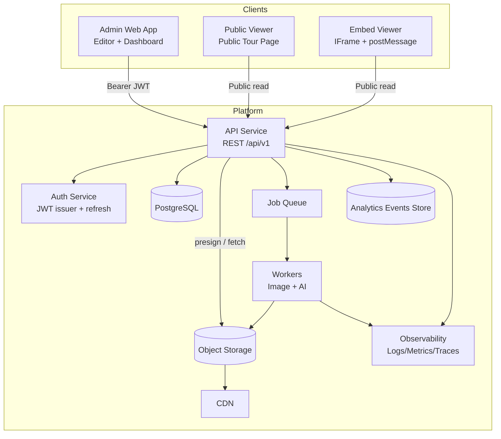

# System Architecture

This document defines the target architecture for the 360 Tours Platform.

## Goals (MVP)

- Deliver a fast, reliable 360° viewing experience on desktop + mobile.
- Provide an authenticated editor for creating tours, scenes, and hotspots.
- Support public/unlisted sharing and iframe embeds.
- Maintain a clear separation between **public read** and **private authoring**.

## Non-goals (MVP)

- Realtime collaboration and multi-editor concurrency controls.
- Native mobile apps.
- Fully offline viewing.

## High-level components

## System boundaries

- **Frontend** (web): tour authoring, tour playback, embeds.
- **Backend API**: authentication, authorization, CRUD, publishing, analytics ingestion and aggregation, AI job orchestration.
- **Storage**: raw + processed media objects.
- **Workers**: asynchronous processing (image derivatives, metadata extraction, AI).

## Core data domains

Canonical schemas are defined in `../00-conventions.md`.

- Tours (settings, branding, visibility)
- Scenes (panorama assets + metadata)
- Hotspots (typed content + positions)
- Floor plans (per-floor images + markers)
- Analytics events (append-only stream)
- AI jobs (async orchestration)

## Key flows

### Authenticated authoring

1. Client authenticates and receives `access_token` + `refresh_token`.
2. Client creates a Tour in `draft` status.
3. Client uploads media using the upload flow defined in `api-specification.md`.
4. Client creates Scenes referencing uploaded assets.
5. Client adds Hotspots and updates positions.
6. Client publishes the tour (status becomes `published`).

### Public viewing

- Public/unlisted tours are retrievable from public endpoints without authentication.
- Viewer fetches **tour + scenes + hotspots + floor plans** in a read-only shape.
- Viewer reports analytics events via an ingestion endpoint.

### Image processing

- Uploads are written to object storage.
- Backend enqueues a processing job.
- Workers generate derivatives (thumbnails, web-optimized variants) and update scene/media metadata.

### AI processing (MVP, opt-in)

- Backend enqueues AI jobs (e.g., hotspot suggestions).
- Workers produce structured outputs that can be applied to drafts with explicit user confirmation.

## Security model

- Authenticated endpoints MUST enforce tenant ownership.
- Public endpoints MUST only return data for tours with `visibility=public|unlisted`.
- Unlisted tours MUST not be indexable and SHOULD use unguessable identifiers.
- Media URLs returned to unauthorized clients MUST be either:
  - non-public, short-lived signed URLs, or
  - public CDN URLs only for public/unlisted tours.

## Performance model

- Public viewer SHOULD load the initial scene under typical mobile conditions in < 3s.
- Navigation between scenes SHOULD feel instantaneous (target < 300ms perceived).
- API list endpoints MUST be paginated.

**Document Links**:
- [Technical README](README.md) ← Index
- [API Specification](api-specification.md) → Backend contract
